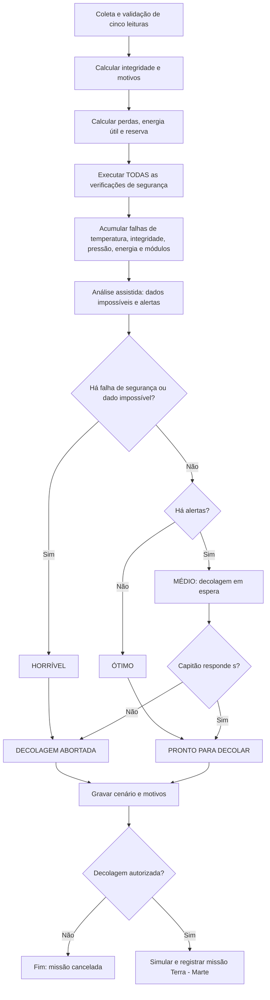
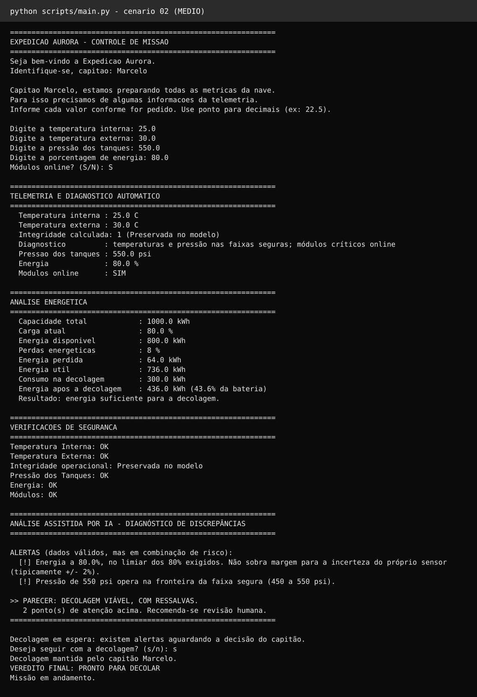
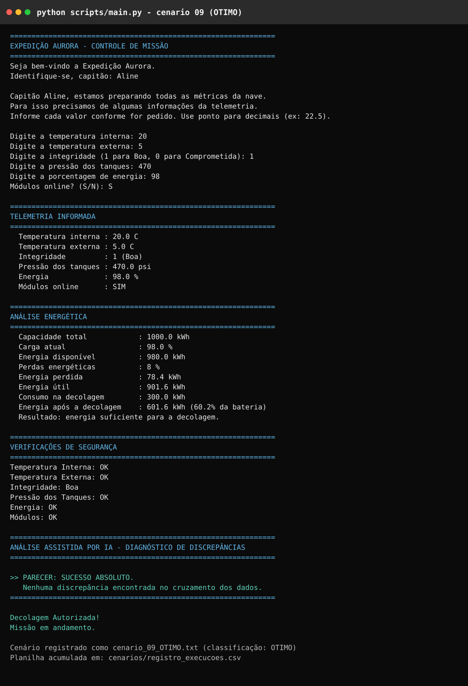

# Projeto AURORA — Sistema de Verificação de Decolagem

Atividade integradora (PBL) — FIAP

Sistema de análise de telemetria que decide se uma nave está apta a decolar,
combinando verificações de faixas seguras, cálculo de autonomia energética e uma
camada de análise que cruza os parâmetros em busca de discrepâncias.

---

## Sobre o projeto

O sistema recebe cinco dados de telemetria, calcula a integridade operacional
e emite um veredito. A parte
interessante não é a verificação em si — é o que ela **não** consegue ver sozinha.

Durante os testes, informamos energia de 105%. As seis verificações de segurança
aprovaram: 105 não é menor que 80. O sistema teria autorizado a decolagem de uma
nave com um sensor claramente corrompido.

Foi isso que motivou a terceira camada do projeto. Cada regra estava correta
isoladamente; o conjunto delas, ainda assim, falhava.

A integridade é avaliada automaticamente a partir das temperaturas, da pressão e
do estado dos módulos. O operador informa as leituras; o sistema calcula o
indicador `integridade` e apresenta os motivos do diagnóstico.

### Integridade calculada pelo sistema

A integridade operacional estimada vale `1` (preservada no modelo) somente quando:

- a temperatura interna está entre 15 e 30 °C;
- a temperatura externa está entre -10 e 45 °C;
- a pressão dos tanques está entre 450 e 550 psi;
- os módulos críticos estão online.

Os limites são inclusivos. Qualquer falha gera `0` (comprometida no modelo),
explica os critérios reprovados e bloqueia a decolagem. Energia e reserva são
avaliadas separadamente; integridade `1` não garante autorização para decolar.
Os alertas de correlação também continuam sendo avaliados.

Esta é uma estimativa operacional didática. Temperaturas, pressão e módulos não
comprovam a ausência de danos físicos no casco: uma avaliação estrutural real
exigiria sensores específicos. A aplicação usa as cinco leituras informadas,
sem conexão com sensores reais e sem perguntar ao usuário se a nave está íntegra.

## Como funciona

Todo o projeto é **um único programa**, `scripts/main.py`, escrito como um
roteiro lido de cima para baixo: as constantes ficam no topo, e cada etapa vem
em sequência, sem funções. A verificação de decolagem trabalha em três fases;
se a decolagem for autorizada, o mesmo programa segue para a simulação da
missão Terra → Marte (descrita mais abaixo).

### Fase 0 — Análise energética

Antes das verificações, o programa converte a carga digitada em energia e segue
os termos do material da disciplina, nesta ordem:

| Termo | Cálculo | Exemplo (carga 80 %) |
| :--- | :--- | --: |
| Energia disponível (kWh) | capacidade total × carga atual | 800 |
| Energia perdida (kWh) | energia disponível × perdas (8 %) | 64 |
| Energia útil (kWh) | energia disponível − energia perdida | 736 |
| Energia restante (kWh) | energia útil − consumo da decolagem (300 kWh) | 436 |

### Fase 1 — Verificações de segurança

Seis parâmetros comparados com faixas predefinidas:

| Parâmetro | Faixa segura | Condição de aborto |
| :--- | :--- | :--- |
| Temperatura interna | 15 °C a 30 °C | fora da faixa |
| Temperatura externa | −10 °C a 45 °C | fora da faixa |
| Integridade operacional estimada | 1, calculada pelo sistema | 0: algum critério de integridade falhou |
| Pressão dos tanques | 450 a 550 psi | fora da faixa |
| Nível de energia | mínimo de 80 % | abaixo de 80 % |
| Módulos críticos | todos online | qualquer um offline |

As verificações **não abortam em cascata**: todas são executadas, e cada uma pode
desligar a chave de autorização. O operador precisa enxergar todos os problemas de
uma vez, e não descobrir o próximo defeito só na tentativa seguinte.

### Fase 2 — Análise assistida por IA

Um sistema especialista cruza os parâmetros entre si, em quatro grupos de regras:

| Grupo | Pergunta que responde | Exemplo |
| :--- | :--- | :--- |
| 1 | Os dados são fisicamente possíveis? | energia acima de 100 % |
| 2 | Os dados são coerentes entre si? | bateria a 82 % com −8 °C lá fora |
| 3 | Algum parâmetro opera sem margem? | pressão a 548 psi (limite: 550) |
| 4 | A telemetria parece real? | todos os canais no valor nominal exato |

A escolha por regras locais, em vez de uma chamada a um modelo de linguagem
externo, foi deliberada: o sistema precisa funcionar sem internet, sem chave de API
e de forma determinística — a mesma entrada produz sempre o mesmo veredito. Em um
sistema que decide sobre segurança, reprodutibilidade é requisito.

### Fase 3 — Veredito

| Classificação | Significado |
| :--- | :--- |
| **ÓTIMO** | Autorizada, nenhuma discrepância encontrada |
| **MÉDIO** | Em espera: consumindo margem de segurança — a decisão passa para o capitão |
| **HORRÍVEL** | Abortada por falha de segurança ou telemetria não confiável |

Ao final, além da classificação, o programa imprime literalmente um dos dois vereditos pedidos no enunciado: `VEREDITO FINAL: PRONTO PARA DECOLAR` ou `VEREDITO FINAL: DECOLAGEM ABORTADA`.

A faixa intermediária existe por decisão de projeto: um veredito binário empurra a
decisão inteiramente para o algoritmo, enquanto um resultado que diz "liberado, mas
observe estes três pontos" devolve a decisão a quem tem responsabilidade sobre ela.

No cenário MÉDIO essa devolução é literal. O programa avisa que a decolagem está
em espera, lista os alertas e pergunta ao capitão se deseja seguir. Só a resposta
`s` mantém a decolagem; qualquer outra (`n`, Enter vazio, "talvez") aborta. O
capitão funciona como mais uma verificação: ele pode desligar a chave de
autorização, nunca ligar uma que a IA desligou.

### O fluxo completo



Todas as verificações são executadas antes da classificação. As falhas se
acumulam e a análise assistida também roda nos cenários já bloqueados. Um erro
de segurança ou dado impossível resulta em HORRÍVEL e impede a decolagem.
Sem falhas, alertas resultam em MÉDIO e exigem a decisão do capitão; sem alertas,
o cenário é ÓTIMO. O TXT registra as falhas, os alertas, a decisão humana quando
aplicável e o veredito final.

---

## Instruções de execução

### Pré-requisitos

**Python 3.6 ou superior** é o único requisito obrigatório.

**Não é necessário instalar nenhuma dependência.** O programa usa apenas a
biblioteca padrão do Python (`csv`, `os`, `math`, `datetime`). Não há
`requirements.txt` porque não há o que instalar.

Para verificar se o Python já está instalado, abra o terminal e digite:

```bash
python --version
```

Se aparecer algo como `Python 3.12.10`, está tudo certo. Se o comando não for
reconhecido, baixe o Python em [python.org/downloads](https://www.python.org/downloads/).

> **Windows:** durante a instalação, marque a opção **"Add Python to PATH"** na
> primeira tela. Sem isso, o comando `python` não funciona no terminal.
>
> Em algumas instalações o comando é `python3` em vez de `python`. Se um não
> funcionar, tente o outro.

### 1. Obter o projeto

Com Git instalado:

```bash
git clone https://github.com/MRC888/Aurora-PBL-FIAP.git
cd Aurora-PBL-FIAP
```

Sem Git: baixe o ZIP pelo botão verde **Code > Download ZIP** na página do
repositório, extraia a pasta e abra o terminal dentro dela.

### 2. Executar o programa

```bash
python scripts/main.py
```

O programa começa pedindo o nome do capitão (só para o registro) e depois
solicita os cinco dados pelo teclado, um de cada vez:

| Pergunta | O que digitar | Exemplo |
| :--- | :--- | :--- |
| Identifique-se, capitão | seu nome | `Douglas` |
| Temperatura interna | número em °C | `23` |
| Temperatura externa | número em °C | `20` |
| Pressão dos tanques | número em psi | `495` |
| Porcentagem de energia | número de 0 a 100 | `92` |
| Módulos online | `S` para sim, `N` para não | `S` |

Use **ponto** para decimais (`22.5`), não vírgula — é a notação que o Python
entende. Valores não numéricos, NaN e infinito são rejeitados e a pergunta se
repete. Para os módulos, somente `S` ou `N` são aceitos. A integridade aparece
na saída como resultado calculado, acompanhada dos motivos do diagnóstico.

Se o veredito for MÉDIO, há uma pergunta adicional de decisão:
`Deseja seguir com a decolagem? (s/n)`. Responder `s` mantém a decolagem;
qualquer outra resposta aborta.

Cada execução grava automaticamente dois arquivos na pasta `cenarios/`:

- `registro_execucoes.csv` — uma linha por execução, acumulativo (abre no Excel)
- `cenario_XX_CLASSE.txt` — o relatório completo daquela execução

A pasta é criada sozinha na primeira execução, e a numeração continua de onde
parou. Se a decolagem for autorizada, o programa continua direto para a missão
Terra → Marte (item 4 abaixo); se for abortada, ele encerra com a mensagem
`MISSAO CANCELADA`.

Para reproduzir os cenários da tabela mais abaixo, basta digitar as
cinco entradas de cada linha; todos esses exemplos usam módulos `S`, e a coluna
de integridade é um resultado. Nos MÉDIOS, responda `s`, exceto no cenário 12
(`n`). Para iniciar uma coleta separada, use uma cópia limpa do projeto sem os
registros de `cenarios/` e `missoes/`.

### 3. Abrir o notebook

O notebook reúne os itens 1.1 a 1.5, lê os cenários e as missões gravados e
executa de ponta a ponta (a reflexão crítica, item 1.6, está no relatório em
PDF). Diferente dos scripts, ele **exige a instalação do Jupyter**:

```bash
pip install jupyter
jupyter notebook notebook/aurora_pbl.ipynb
```

Depois de abrir no navegador, use o menu **Run > Run All Cells** para executar
tudo em ordem.

Alternativa sem instalar nada: o GitHub renderiza o notebook automaticamente ao
clicar no arquivo, e o VS Code o abre com a extensão *Jupyter*.

**Gráfico opcional.** A célula final gera um gráfico de barras se a biblioteca
`matplotlib` estiver instalada:

```bash
pip install matplotlib
```

Sem ela, nada quebra — os mesmos dados aparecem em formato de tabela nas células
anteriores.

### 4. A missão Terra → Marte

Não há comando separado: a missão é a continuação do `main.py` quando a
decolagem é autorizada. A IA escolhe a rota pela **carga pré-decolagem** (90 % ou
mais vai pela rota rápida; abaixo disso, pela econômica) e simula a missão hora a
hora, em quatro fases: saída da atmosfera, cruzeiro interplanetário, captura
orbital em Marte e pouso. Na tela aparece só o **resumo da missão** no fim
(capitão, verificação, rota, horas, bateria, horas em cada estado e status).

**Modelo energético unificado.** A simulação não reinicia a bateria e não cobra a
decolagem uma segunda vez. Ela começa exatamente em `autonomia_restante`, valor
calculado no item 1.4 depois das perdas de 8 % e do consumo de 300 kWh. Assim,
por exemplo, uma carga de 100 % deixa 62 % da capacidade para o início da missão,
e esse mesmo saldo segue para a simulação Terra → Marte.

A cada hora a IA calcula o saldo de energia (recarga solar menos o consumo dos
sistemas ligados), decide o estado da nave e age:

| Estado | Quando | O que a IA faz |
| :--- | :--- | :--- |
| 🟢 Verde | bateria alta | tudo ligado |
| 🟡 Amarelo | bateria média, ou margem de retorno ameaçada | desliga a prioridade 3, comunicação em modo econômico |
| 🔴 Vermelho | bateria baixa, tempestade, ou margem crítica | só o essencial (prioridade 1) |

Os riscos são programados, não sorteados: uma tempestade solar no cruzeiro e uma
tempestade de poeira na superfície acontecem sempre nas mesmas horas, para que a
mesma entrada produza sempre a mesma missão. Se uma manobra de correção de rota
cair durante a tempestade solar, a IA a adia para a primeira hora com clima
normal e registra o adiamento na caixa preta.

Cada missão grava dois arquivos na pasta `missoes/`:

- `registro_missoes.csv` — uma linha por missão (rota, horas, bateria final, horas em cada estado)
- `missao_XX_STATUS.txt` — a "caixa preta": todas as horas e todas as decisões da IA

Para assistir ao voo hora a hora na tela (fases, decisões da IA, eventos e a
tabela de telemetria), troque a constante `MOSTRAR_VOO_NA_TELA` para `True` no
início do `main.py`. Nesse modo a tela mostra menos linhas que o arquivo: em
Amarelo a telemetria sai a cada 2 h, em Vermelho a cada 4 h. O arquivo guarda
tudo nos dois casos.

Os números adicionais da extensão (custos pós-decolagem de manobra,
frenagem e pouso, consumo dos cinco sistemas, recarga solar, reserva de retorno,
duração das fases e tempestades) ficam nas constantes do `main.py`, identificados
como `ASSUMIDO` quando são escolhas didáticas do grupo. O único custo de
decolagem é o do item 1.4: 300 kWh após a aplicação das perdas energéticas.

### Problemas comuns

| Sintoma | Causa provável | Solução |
| :--- | :--- | :--- |
| `python: command not found` | Python não instalado ou fora do PATH | Reinstale marcando "Add Python to PATH", ou tente `python3` |
| Mensagem `Valor inválido` | Foi digitado texto ou vírgula onde se espera número | Use apenas números, com ponto decimal (`22.5`) |
| Acentos aparecem como `?` ou `ç` no terminal | Codificação do console do Windows | Rode `chcp 65001` antes, ou use o Windows Terminal |
| `can't open file 'scripts/main.py'` | Terminal está na pasta errada | Entre na pasta raiz do projeto antes de executar |

---

## Prints da execução

Abaixo estão duas execuções reais do `scripts/main.py`, cobrindo dois resultados distintos do sistema: um cenário **MÉDIO**, em que existem alertas e a decisão final passa pelo capitão, e um cenário **ÓTIMO**, em que nenhuma discrepância é encontrada.

### Cenário 02 — MÉDIO | decolagem autorizada com ressalvas

Entrada principal: temperatura interna `25 °C`, externa `30 °C`, pressão `550 psi`, energia `80%` e módulos online. O sistema calcula integridade `1`, identifica dois alertas de margem, classifica o cenário como **MÉDIO** e transfere a decisão ao capitão, que autoriza a decolagem.



### Cenário 09 — ÓTIMO | decolagem autorizada

Entrada principal: temperatura interna `20 °C`, externa `5 °C`, pressão `470 psi`, energia `98%` e módulos online. A integridade calculada é `1`, todas as verificações são aprovadas, a análise assistida não encontra discrepâncias e o cenário é classificado como **ÓTIMO**.



---

## Cenários coletados

Os 12 cenários foram reexecutados com as cinco entradas originais e a integridade
calculada automaticamente, cobrindo as três classificações e as duas
respostas possíveis do capitão. Nos cenários MÉDIO a coluna "Decolagem" é a
resposta dele:

| # | Capitão | Classificação | T.int | T.ext | Integr. calculada | Pressão | Energia | Críticos | Alertas | Decolagem |
| :-- | :--- | :--- | --: | --: | --: | --: | --: | --: | --: | :--- |
| 01 | Douglas | HORRÍVEL | 10 | 50 | 0 | 350 | 70 | 0 | 1 | abortada |
| 02 | Marcelo | MÉDIO | 25 | 30 | 1 | 550 | 80 | 0 | 2 | autorizada pelo capitão |
| 03 | Aline | ÓTIMO | 25 | 30 | 1 | 480 | 100 | 0 | 0 | autorizada |
| 04 | Douglas | ÓTIMO | 23 | 20 | 1 | 495 | 92 | 0 | 0 | autorizada |
| 05 | Marcelo | MÉDIO | 21 | −9 | 1 | 500 | 85 | 0 | 1 | autorizada pelo capitão |
| 06 | Aline | MÉDIO | 29 | −8 | 1 | 535 | 93 | 0 | 3 | autorizada pelo capitão |
| 07 | Douglas | ÓTIMO | 22 | 25 | 1 | 500 | 90 | 0 | 0 | autorizada |
| 08 | Marcelo | HORRÍVEL | 22 | 25 | 1 | 500 | 105 | **1** | 0 | abortada |
| 09 | Aline | ÓTIMO | 20 | 5 | 1 | 470 | 98 | 0 | 0 | autorizada |
| 10 | Douglas | HORRÍVEL | 24 | 28 | 1 | 505 | 55 | 0 | 0 | abortada |
| 11 | Marcelo | MÉDIO | 25 | 30 | 1 | 450 | 90 | 0 | 1 | autorizada pelo capitão |
| 12 | Aline | MÉDIO | 20 | 30 | 1 | 480 | 80 | 0 | 1 | **vetada pelo capitão** |

A distribuição atual é **4 ÓTIMOS, 5 MÉDIOS e 3 HORRÍVEIS**. O cenário **07**
passou a ÓTIMO: suas temperaturas, pressão e módulos estão adequados. O bloqueio
anterior vinha exclusivamente do valor manual `0`, que deixou de existir como
entrada. Os registros têm a data da nova execução e substituem os exemplos da
lógica anterior, preservada no histórico do Git.

Três outros cenários merecem destaque:

O **08** é o caso em que a análise barrou o que as verificações aprovaram. Note a
energia disponível calculada para ele: **1050 kWh em uma bateria de 1000 kWh** — a
prova numérica de que o dado era impossível.

O **09** cumpre o papel oposto: com temperatura externa de 5 °C, ele *não* dispara
o alerta de frio. Isso demonstra que a regra discrimina de fato, em vez de alertar
sobre qualquer coisa.

O **12** é a decisão humana em ação: energia no limiar exato de 80 %, um alerta,
classificação MÉDIO, e a capitã respondeu `n`. A decolagem foi abortada e a
missão não aconteceu, com a mesma telemetria que em outro dia poderia ter sido
liberada.

As 8 decolagens autorizadas geraram as 8 missões da pasta `missoes/`.
Os registros foram recalculados com o **mesmo saldo energético do item 1.4**:
a missão começa na energia pós-decolagem já descontadas as perdas e os 300 kWh,
sem aplicar um segundo custo de lançamento. Os resultados atualizados ficam em
`missoes/registro_missoes.csv` e nas respectivas caixas-pretas em TXT.
São **6 missões concluídas com risco e 2 falhas**. As missões 06 (cenário 07)
e 08 (cenário 11) esgotam a bateria na hora 90: a aprovação da pré-decolagem não
garante sucesso na extensão Terra → Marte. A missão adicional desloca a numeração
das posteriores; a ordem segue as decolagens autorizadas.

---

## Estrutura do repositório

```
├── scripts/
│   └── main.py               O PROGRAMA: verificação de decolagem + missão Terra → Marte
├── cenarios/                 12 cenários coletados (CSV + relatórios TXT)
├── missoes/                  8 missões simuladas (CSV + caixa preta TXT)
├── docs/                     PDF atualizado e imagens de execução
├── tests/                    testes da integridade automática
└── notebook/
    └── aurora_pbl.ipynb      notebook com os itens 1.1 a 1.5 e a leitura dos registros
```

O [relatório em PDF atualizado](docs/Aurora-2.0.pdf) inclui a reflexão crítica
(item 1.6) e é entregue junto com o
link deste repositório. O fluxograma da decisão está na seção "Como funciona"
deste README, em formato Mermaid, que o GitHub renderiza automaticamente.

---

## Parâmetros do modelo energético

| Constante | Valor | Origem |
| :--- | :--- | :--- |
| Capacidade da bateria | 1000 kWh | Definida na especificação |
| Consumo na decolagem | 300 kWh | Definido na especificação |
| Perdas energéticas | 8 % da energia armazenada | Estimativa do grupo (conversão + aquecimento) |
| Reserva mínima de pouso | 10 % | Decisão do grupo |

Vale registrar: com 300 kWh de consumo e 8 % de perdas, a energia mínima
*matemática* para decolar seria de cerca de 32,6 % de carga (326 kWh disponíveis,
300 kWh úteis). O limite de 80 % não vem do consumo da decolagem — ele existe
para garantir autonomia **depois** dela.

## Validação da integridade automática

Execute `python -m unittest discover -s tests -v` para verificar os limites das
faixas, falhas individuais e combinadas, entradas inválidas, decisão do capitão
e consistência do registro. Os testes usam pastas temporárias.
